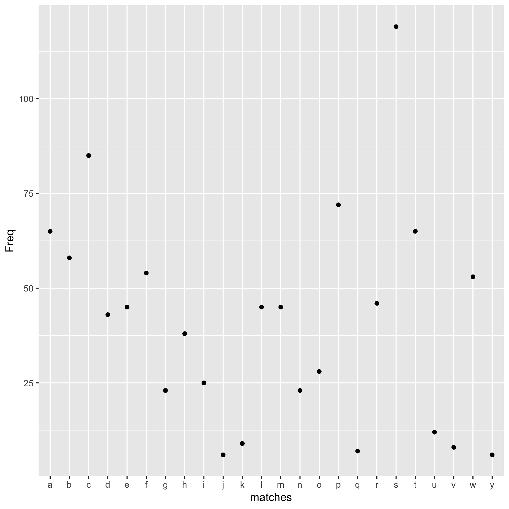

```{r load-Letters, include = FALSE}
Letters <- read.delim("histogram2.tsv")
```

This is an analysis of the file `/usr/share/dict/words`, which contains a list of words.

I calculate the number of words that begin with each letter of the English alphabet.

Words in the file most frequently begin with the letter `r with(Letters, matches[which.max(Freq)])`.

Here is a histogram of initial letters.

